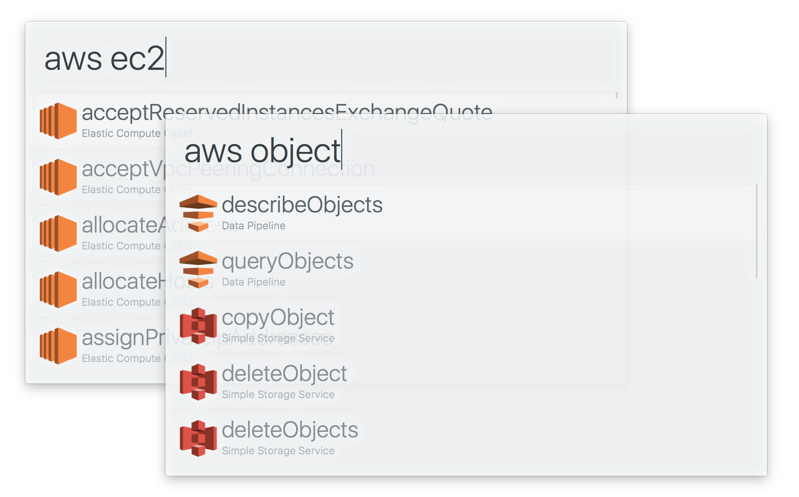

# arvis-aws [](https://travis-ci.org/SamVerschueren/arvis-aws)

> Search through the [AWS JavaScript SDK](http://docs.aws.amazon.com/AWSJavaScriptSDK/latest/top-level-namespace.html)




## Install

```
$ npm install -g arvis-aws
```

*Requires [Node.js](https://nodejs.org) 4+ and the arvis [Powerpack](https://www.arvisapp.com/powerpack/).*


## Usage

In arvis, type `aws`, <kbd>Enter</kbd>, and your query.

Select an item and press <kbd>Enter</kbd> to go to the AWS SDK documentation page.<br>
Press <kbd>Shift</kbd> to view the documentaion in Quick Look.


## Related

- [arvis-ng](https://github.com/SamVerschueren/arvis-ng) - Search for Angular API references
- [arvis-npms](https://github.com/sindresorhus/arvis-npms) - Search for npm packages with npms.io
- [arvis-font-awesome](https://github.com/SamVerschueren/arvis-font-awesome) - Search for font-awesome icons
- [arvish](https://github.com/sindresorhus/arvish) - Create arvis workflows with ease


## License

MIT © [Sam Verschueren](https://github.com/SamVerschueren)
